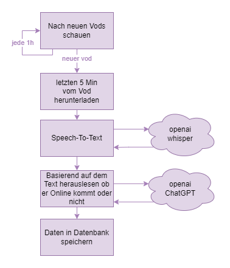

# KommtKevinOnline.de

## Beschreibung

Info Webseite darüber ob der Twitch Streamer Papaplatte heute Online kommt. Die Daten werden über die letzten Minuten des letzten Streams mit Speech To Text und ChatGPT analysiert.

## Funktionsweise

## 📚 Dependencies

| Name                                           | Used for                                                    |
| ---------------------------------------------- | ----------------------------------------------------------- |
| [Vue](https://vuejs.org)                       | UI Framework                                                |
| [Nuxt](https://nuxt.com/)                      | SSR + Backend                                               |
| [Nuxt Ui](https://ui.nuxt.com/)                | UI Components                                               |
| [Vue Bits](https://vue-bits.dev/)              | [Background Pattern](https://vue-bits.dev/backgrounds/silk) |
| [Postgres](https://www.postgresql.org/)        | Database                                                    |
| [Whisper](https://openai.com/research/whisper) | Audio Transcription                                         |
| [ChatGPT](https://openai.com/blog/chatgpt)     | Text Classification                                         |
| [Twitch API](https://dev.twitch.tv/docs/api/)  | Acquiring online status and vods                            |
| [7tv](https://7tv.app/)                        | Displaying Emotes                                           |
